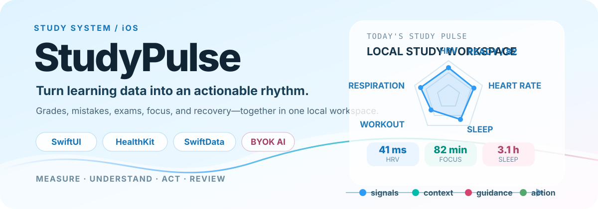
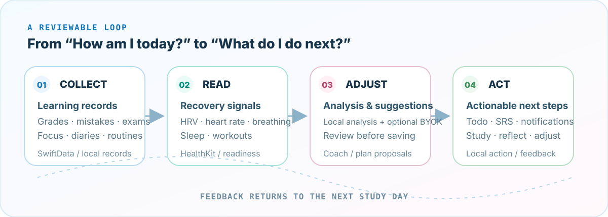

<p align="center">
  
</p>

<p align="center">
  <a href="./README.md">简体中文</a> ·
  <a href="./README.en.md">English</a>
</p>

<p align="center">
  <a href="https://gao-chenkai.github.io/StudyPulse/">Product overview</a> ·
  <a href="./docs/README.md">Documentation</a> ·
  <a href="#build-and-run">Run locally</a> ·
  <a href="#privacy-boundaries">Privacy boundaries</a>
</p>

# StudyPulse

> A local-first iOS learning system for iPhone and iPad.
>
> StudyPulse brings grades, mistakes, exams, todos, focus time, study diaries, and HealthKit recovery signals into one workspace, then turns analysis into next steps that can be reviewed, executed, and reflected on.

StudyPulse is not just a timer that records how long you studied today, nor a black-box chatbot that executes your study plan for you. It is a learning pulse you can look back on: read the evidence first, choose the intensity next; review suggestions first, then turn them into action.

## See what it can do

<p align="center">
  
</p>

### One learning loop

<p align="center">
  
</p>

- **Collect**: Manage grades, mistakes, exams, todos, study diaries, routines, and focus sessions in one place. Mistakes support OCR, images, Markdown, handwritten answers, and PDF export.
- **Read**: HealthKit provides HRV, heart rate, respiratory rate, deep and REM sleep, and Apple workout signals. Combined with personal baselines, they inform learning readiness and recommended intensity.
- **Adjust**: Local analysis organizes the evidence. When BYOK is enabled and configured, AI Coach, AI Quiz, Similar Question, Auto Mind Map, and Mistake Debate can provide explanations and proposals.
- **Act**: You can edit, select, reject, or confirm suggestions. Only confirmed plans enter Todo, and the results of your study flow back into the next review cycle.

## Real interface

These images are product showcase assets stored in the repository, so the homepage does not rely on temporary GitHub attachment links.

<table>
  <tr>
    <td width="50%"></td>
    <td width="50%"></td>
  </tr>
  <tr>
    <td width="50%"></td>
    <td width="50%"></td>
  </tr>
</table>

## Capability map

### Learning workspace

- Grade tracking and trend charts: custom maximum scores, raw scores, ranks, importance, and grade attachments.
- Mistake notebook: four sections for the question, error cause, incorrect approach, and correct approach, with independent image attachments and OCR.
- SRS / SM-2 flashcard review: review queues, next-review dates, local notifications, and review summaries.
- Exams and Todo: single-subject and comprehensive exams, multi-day exams, time slots, exam checklists, system Calendar, and Reminders.
- Study diaries, mood, energy, routines, streaks, achievements, and habit insights.

### Body status and focus

- A 14-day HRV baseline and 30-day personal body baselines.
- Readiness recommendations across five study intensities and five learning-focus categories.
- Study Timer, Lock Screen / Dynamic Island Live Activity, and study-session history.
- iPhone and iPad layouts, widgets, App Intents, and App Group data synchronization.

### Optional AI learning tools

- **AI Coach**: Combine evidence from goals, grades, mistakes, exams, focus, health, and diaries to generate evidence-based analysis and plan proposals.
- **AI Quiz / Similar Question**: Generate multiple-choice, fill-in-the-blank, and similar questions around mistakes or subjects, then grade and explain the results.
- **Auto Mind Map**: Organize mistake content into a collapsible tree of knowledge nodes.
- **Mistake Debate**: Use multi-turn dialogue to help students break down their incorrect reasoning instead of only receiving an answer.

> AI features are optional and require an enabled, compatible BYOK model configured in Settings. Local learning analysis and Todo management remain controlled by the app; generated plans must be confirmed by the user before they become tasks.

## Technical foundation

- **SwiftUI + MVVM + Repository**: Views handle rendering and interaction, ViewModels own page state, Repositories handle data access, and pure-function Services provide filtering, aggregation, suggestions, and algorithms.
- **SwiftData**: Versioned schema migrations persist structured records; legacy JSON is migrated once at launch. Preferences, widgets, and some historical data are stored locally or in the App Group according to their boundaries.
- **Swift 6 strict concurrency**: MainActor isolation by default, `nonisolated` value types for cross-actor data, plus shared logging, hang monitoring, and backup / restore infrastructure.
- **Apple native frameworks**: HealthKit, Charts, Vision, EventKit, ActivityKit, WidgetKit, AppIntents, PhotosUI, and UserNotifications.

## Build and run

Current project configuration: macOS 15+, Xcode 26.x, Swift 6.0, and iOS 26.0+. Open `StudyPulse.xcodeproj`, select the `StudyPulse` scheme, and run it on a simulator or a device.

```bash
# Debug build (the script uses an isolated DerivedData directory by default)
./scripts/build.sh

# Run tests
./scripts/build.sh test

# List available simulators
./scripts/build.sh list
```

You can also resolve the local Swift Package in Xcode through File → Packages → Resolve Package Versions, then run with Cmd+R.

> Do not let Xcode and command-line builds use the same DerivedData directory at the same time, or `build.db` locks may occur. The script uses the repository-local `DerivedDataBuild/` directory by default.

## Privacy boundaries

- HealthKit is read-only: the app reads HRV, heart rate, respiratory rate, sleep, and workout data, but does not write data to HealthKit.
- Study records are managed on-device by default. SwiftData, UserDefaults, and the App Group handle structured data, preferences, and widget sharing respectively.
- AI is an explicitly enabled external capability. Before enabling BYOK, confirm the provider, Base URL, model, and content that will be sent. When it is not configured, local features remain available; “AI available” does not mean data is uploaded by default.
- Camera, Photos, Calendar, Reminders, Health, and notification permissions are requested only when the corresponding feature is enabled.

## Further reading

- [Documentation hub](./docs/README.md)
- [Study suggestions algorithm](./docs/algorithms/AlgorithmIntroduction.md)
- [Mistake shelf life and review](./docs/algorithms/MistakeShelfLife.md)
- [Study readiness](./docs/algorithms/StudyReadiness.md)
- [Spaced repetition](./docs/algorithms/SpacedRepetition.md)
- [Score prediction](./docs/algorithms/ScorePrediction.md)
- [Product design](./docs/product/DESIGN.md)

## Developers and license

- Gao-Chenkai
- Ken8891837 (both accounts are used by Gao Chenkai)
- This project accepts Codex collaboration subject to manual review.

License: CC BY-NC-SA 4.0. See [LICENSE](./LICENSE).
