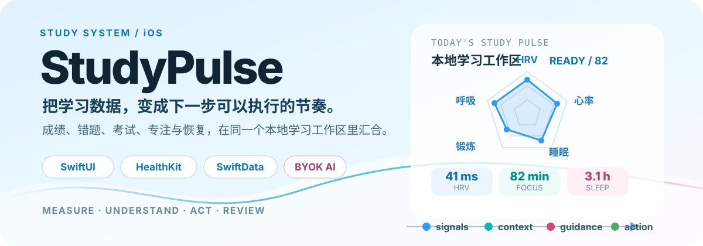
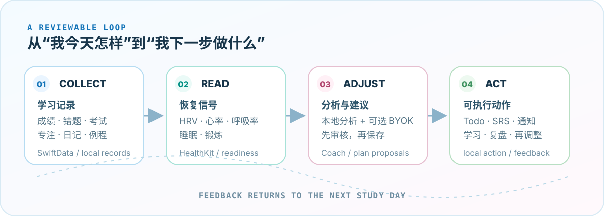

<p align="center">
  
</p>

<p align="center">
  <a href="https://gao-chenkai.github.io/StudyPulse/">产品介绍</a> ·
  <a href="./docs/README.md">文档中心</a> ·
  <a href="#构建与运行">本地运行</a> ·
  <a href="#隐私边界">隐私边界</a>
</p>

# StudyPulse

> 一个面向 iPhone 与 iPad 的本地优先 iOS 学习系统。
>
> 它把成绩、错题、考试、待办、专注时长、学习日记与 HealthKit 恢复信号放进同一个工作区，再把分析结果转成可以审核、执行和复盘的下一步。

StudyPulse 不是只记录“今天学了多久”的计时器，也不是把学习计划交给黑箱自动执行的聊天机器人。它更像一条可回看的学习脉搏：先看证据，再决定强度；先审核建议，再写入行动。

## 先看它能做什么？

<p align="center">
  
</p>

### 一条学习闭环

<p align="center">
  
</p>

- **收集**：成绩、错题、考试、Todo、学习日记、例程与专注会话统一管理；错题支持 OCR、图片、Markdown、手写答题与 PDF 导出。
- **读取**：HealthKit 提供 HRV、心率、呼吸率、深睡与 REM、Apple 锻炼等信号，结合个人基线推导学习准备度与推荐强度。
- **调整**：本地分析负责组织证据；启用并配置 BYOK 后，AI Coach、AI 自测、相似题、思维导图和错题辩论可以提供解释与提案。
- **执行**：你可以修改、选择、拒绝或确认建议；确认后的计划才会进入 Todo，学习结果再回到下一轮复盘。

## 真实界面

这些图来自仓库内的产品介绍素材，主页不再依赖 GitHub 临时附件链接。

<table>
  <tr>
    <td width="50%"></td>
    <td width="50%"></td>
  </tr>
  <tr>
    <td width="50%"></td>
    <td width="50%"></td>
  </tr>
</table>

## 能力地图

### 学习工作区

- 成绩追踪与趋势图：自定义满分、原始分、排名、重要程度和成绩附件。
- 错题本：题目、错误原因、错误解法、正确解法四个区块，可独立添加图片并进行 OCR。
- SRS / SM-2 闪卡复习：复习队列、下次复习日期、本地通知与复习总结。
- 考试与 Todo：单科 / 综合考试、多日考试、时间段、考试清单、系统日历与提醒事项。
- 学习日记、心情、精力、例程、连续打卡、成就与习惯洞察。

### 身体状态与专注

- 14 天 HRV 基线与 30 天个人身体基线。
- 5 档学习强度 × 5 类学习重点的准备度建议。
- Study Timer、Lock Screen / Dynamic Island Live Activity、学习会话历史。
- iPhone 与 iPad 布局、小组件、App Intents 与 App Group 数据同步。

### 可选 AI 学习工具

- **AI Coach**：目标、成绩、错题、考试、专注、健康与日记证据汇合后，生成带依据的分析与计划提案。
- **AI Quiz / Similar Question**：围绕错题或科目生成选择题 / 填空题与相似题，完成后批阅并解释。
- **Auto Mind Map**：把错题内容整理成可折叠的知识节点树。
- **Mistake Debate**：通过多轮对话帮助学生拆解错误思路，而不是只给出答案。

> AI 功能是可选能力，需要在设置中开启并配置兼容的 BYOK 模型。学习数据的本地分析和 Todo 管理由 App 控制；生成的计划必须经过用户确认才会写入任务。

## 技术骨架

- **SwiftUI + MVVM + Repository**：视图负责渲染与交互，ViewModel 负责页面状态，Repository 负责数据访问，纯函数 Services 负责过滤、聚合、建议与算法。
- **SwiftData**：版本化 schema migration 保存结构化记录；旧版 JSON 在启动时一次性迁移。偏好、小组件与部分历史数据按各自边界存储在本地或 App Group。
- **Swift 6 严格并发**：默认 MainActor 隔离；跨 actor 传递使用 `nonisolated` value types；统一日志、卡顿监测与备份 / 恢复基础设施。
- **Apple 原生能力**：HealthKit、Charts、Vision、EventKit、ActivityKit、WidgetKit、AppIntents、PhotosUI 与 UserNotifications。

## 构建与运行

当前工程配置：macOS 15+、Xcode 26.x、Swift 6.0、iOS 26.0+。打开 `StudyPulse.xcodeproj` 后选择 `StudyPulse` scheme，即可在模拟器或真机运行。

```bash
# Debug 构建（默认使用脚本隔离 DerivedData）
./scripts/build.sh

# 运行测试
./scripts/build.sh test

# 列出可用模拟器
./scripts/build.sh list
```

也可以在 Xcode 中通过 File → Packages → Resolve Package Versions 解析本地 Swift Package，再按 Cmd+R 运行。

> 不要让 Xcode IDE 与命令行构建同时使用同一个 DerivedData 目录，否则可能出现 `build.db` 锁。脚本默认使用仓库内独立的 `DerivedDataBuild/`。

## 隐私边界

- HealthKit 只读：应用读取 HRV、心率、呼吸率、睡眠与锻炼数据，不向 HealthKit 写入数据。
- 学习记录默认由 App 在设备侧管理，SwiftData、UserDefaults 与 App Group 分别承担结构化数据、偏好与小组件共享。
- AI 是显式开启的外部能力：启用 BYOK 前，应确认模型服务商、Base URL、模型与发送内容；未配置时使用本地功能，不应把“AI 可用”理解成默认上传。
- 相机、照片、日历、提醒事项、健康与通知权限只在对应功能启用时请求。

## 进一步阅读

- [文档中心](./docs/README.md)
- [学习建议算法](./docs/algorithms/AlgorithmIntroduction.md)
- [错题保质期与复习](./docs/algorithms/MistakeShelfLife.md)
- [学习准备度](./docs/algorithms/StudyReadiness.md)
- [间隔重复](./docs/algorithms/SpacedRepetition.md)
- [成绩预测](./docs/algorithms/ScorePrediction.md)
- [项目设计](./docs/product/DESIGN.md)

## 开发者与许可

- Gao-Chenkai
- Ken8891837（两个账号均为 Gao Chenkai 本人使用）
- 本项目接受经过人工审核的 Codex 协作。

许可：CC BY-NC-SA 4.0。详见 [LICENSE](./LICENSE)。
